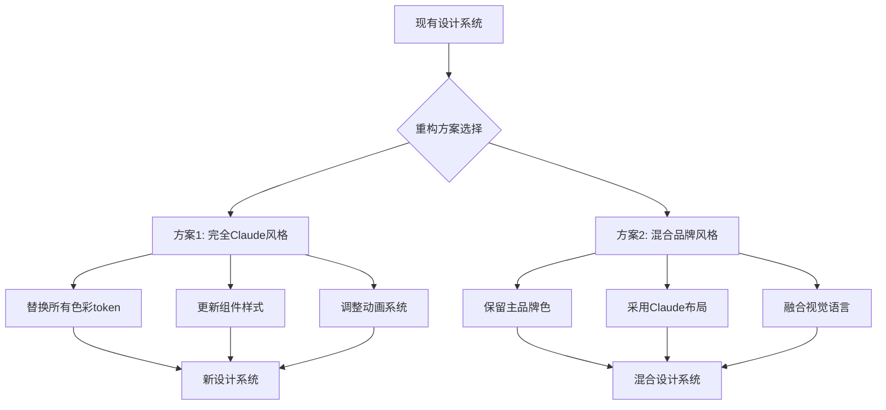

## 产品概述

将现有的Refik Anadol科技风格网站全面重构为Claude官方设计风格，包括UI布局、色彩系统、字体排版和视觉风格的完整转换。

## 核心需求

- **设计风格转换**: 从深色科技风转为温暖专业的Claude风格
- **色彩系统重构**: 电光蓝→Claude橙，深色背景→奶油色/浅灰背景
- **组件样式统一**: 所有UI组件采用Claude设计语言
- **动画系统调整**: 从复杂流动动画转为简约克制的微交互
- **响应式适配**: 确保新设计在所有设备上表现一致
- **品牌融合方案**: 可选择完全采用Claude风格或保留部分品牌色

## 视觉效果描述

**当前风格**: 深色背景、发光效果、流动动画、未来科技感、深海生物发光美学
**目标风格**: 浅色/奶油色背景、柔和阴影、简约布局、温暖专业感、人性化的交互设计

## 技术栈选择

- **前端框架**: Astro (现有) + TypeScript
- **样式方案**: CSS Variables + Scoped Styles (保持现有架构)
- **字体系统**: Inter + HarmonyOS Sans SC (中文)
- **主题系统**: CSS Variables + [data-theme] 属性切换

## 技术架构

### 设计系统重构策略

采用**渐进式重构**方案，保留现有token系统架构，替换设计值：



### 核心差异对比

| 设计维度 | 当前风格 | Claude风格 | 改动难度 |
| --- | --- | --- | --- |
| 主色调 | #00d4ff 电光蓝 | #D97757 Claude橙 | 中 |
| 背景色 | #0a0a0f 深黑 | #FAFAFA/#F5F0E8 浅色 | 高 |
| 文字色 | #ffffff 高对比 | #1A1A1A 深灰 | 低 |
| 阴影效果 | 发光+玻璃态 | 柔和阴影 | 中 |
| 动画时长 | 250-500ms | 150-300ms | 低 |
| 圆角 | 12-24px | 8-16px | 低 |
| 字体大小 | 较大(未来感) | 克制(专业性) | 中 |


### 具体调整内容

**1. 设计Token系统重构** (`src/styles/tokens.css`)

- 主色调迁移: `--color-primary: #D97757`
- 背景色迁移: `--bg-primary: #FAFAFA`, `--bg-secondary: #F5F0E8`
- 移除发光效果变量: 删除 `--glow-*`、`--gradient-glow` 等
- 阴影系统调整: 移除发光阴影，采用柔和阴影

**2. 组件样式重构** (所有 `.astro` 组件)

- Hero组件: 移除发光球体，简化几何装饰
- Header: 从玻璃态悬浮改为固定顶部导航
- Button: 从渐变发光改为纯色+微阴影
- Card: 从玻璃态改为奶油色/白色背景
- 所有section组件: 统一间距和布局逻辑

**3. 动画系统调整** (`src/styles/global.css`)

- 缩短动画时长: 200-300ms
- 简化缓动函数: 统一使用 `ease-out`
- 移除复杂关键帧动画: 如 `orb-float`、`stream-flow`

**4. 深色模式适配**

- Claude深色模式: `#0D0D0D` 背景 + `#E5E5E5` 文字
- 保持主题切换功能，调整配色值

## 技术难点与兼容性问题

### 难点1: 品牌识别度下降

**问题**: 完全采用Claude风格会失去原品牌特色
**解决方案**:

- 方案A: 完全Claude风格 (适合产品导向)
- 方案B: 保留品牌蓝色作为强调色，Claude橙作为次强调色

### 难点2: 现有组件大量依赖发光效果

**问题**: 许多组件使用 `--glow-*`、`--gradient-*` 变量
**解决方案**:

- 创建过渡期CSS映射: 将发光变量映射到Claude柔和值
- 渐进式替换，保持向后兼容

### 难点3: 深色模式视觉转换

**问题**: Claude以浅色为主，深色模式支持有限
**解决方案**:

- 参考Claude深色模式: `#0D0D0D` + `#1A1A1A`
- 保持深色模式的可读性和舒适度

### 难点4: 图片和视觉资源适配

**问题**: 现有视觉资源(如发光球体)与新风格冲突
**解决方案**:

- 替换为简约几何图形
- 使用CSS绘制的装饰元素
- 考虑插画风格替代

## 实现方案

### 方案A: 完全Claude风格 (推荐)

- **优点**: 视觉统一，用户体验一致，专业感强
- **缺点**: 品牌特色弱化，需要重新建立视觉识别
- **适用**: 产品导向，强调易用性和专业性

### 方案B: 混合品牌风格

- **优点**: 保留品牌特色，有差异化优势
- **缺点**: 设计语言不纯粹，可能显得不协调
- **适用**: 品牌导向，强调独特性和记忆点

### 推荐: 方案A + 可选品牌色保留

采用完全Claude风格，但在Logo、关键CTA等位置可选择性保留品牌蓝色作为点缀。

## 目录结构

```
src/
├── styles/
│   ├── tokens.css           # [MODIFY] 核心设计token - 替换为Claude色彩系统
│   ├── global.css           # [MODIFY] 全局样式 - 调整动画和基础样式
│   ├── claude-tokens.css    # [KEEP] 已有的Claude token作为参考
│   └── tokens/
│       └── claude-reset.css # [NEW] Claude风格重置和工具类
├── components/
│   ├── layout/
│   │   ├── Header.astro     # [MODIFY] 导航样式 - 简化为Claude风格
│   │   └── Footer.astro     # [MODIFY] 页脚样式 - 统一配色和布局
│   ├── sections/
│   │   ├── Hero.astro       # [MODIFY] 核心Hero - 移除发光效果
│   │   ├── Stats.astro      # [MODIFY] 统计组件 - 调整卡片样式
│   │   └── Hero-Claude.astro # [KEEP] Claude版本作为参考
│   └── ui/
│       ├── Button.astro     # [MODIFY] 按钮组件 - Claude风格
│       ├── Card.astro       # [MODIFY] 卡片组件 - Claude风格
│       ├── Button-Claude.astro # [KEEP] Claude版本作为参考
│       └── Card-Claude.astro   # [KEEP] Claude版本作为参考
└── layouts/
    └── Layout.astro         # [MODIFY] 默认主题切换为light
```

## 设计风格定位

采用Claude官方设计语言的**温暖专业**风格，以奶油色背景、Claude橙色主调、简约布局为核心特征。

## 页面规划

### 首页

- **Hero区块**: 简约大标题 + 副标题 + 双按钮CTA + 简约几何装饰
- **Stats区块**: 三列统计数据展示，奶油色卡片背景
- **ContributionGraph**: 保持功能，调整为浅色主题

### Chatbot页面

- **聊天界面**: Claude风格消息气泡(用户消息浅橙背景)
- **输入区域**: 固定底部，简洁输入框+发送按钮

### About页面

- **团队介绍**: 卡片式布局，奶油色背景
- **价值观**: 三列布局，简约图标+文字

## 区块设计

### Header导航栏

- **桌面端**: 固定顶部，半透明白色背景+模糊，Claude橙色Logo
- **移动端**: 汉堡菜单，侧滑导航
- **交互**: 链接悬停浅灰背景，当前页Claude橙色标识

### Hero区域

- **标题**: 48-72px Inter字体，600字重，-0.02em字距
- **副标题**: 18px Inter，#6B6B6B次要文字
- **主按钮**: Claude橙背景(#D97757)，白色文字，8px圆角
- **次按钮**: 透明背景，1px灰色边框，悬停浅灰背景

### Stats统计卡片

- **背景**: 白色/奶油色(#F5F0E8)
- **圆角**: 12px
- **阴影**: `0 1px 3px rgba(0,0,0,0.1)`
- **悬停**: 微微上浮(-2px) + 增强阴影

### Footer页脚

- **背景**: #FAFAFA浅灰
- **布局**: 多列链接布局
- **文字**: #6B6B6B次要文字色

## 交互设计

- **按钮悬停**: 200ms过渡，背景加深，微微上浮(-1px)
- **卡片悬停**: 300ms过渡，上浮(-2px)，阴影增强
- **输入聚焦**: 边框变为Claude橙色，微妙发光
- **页面加载**: 600ms淡入动画，错落显示

## 使用的扩展

### SubAgent

- **code-explorer**: 用于搜索和分析项目中所有使用发光效果变量的组件，确保重构不遗漏任何依赖项

**预期成果**: 完整列出所有需要修改的文件和具体的CSS变量引用位置